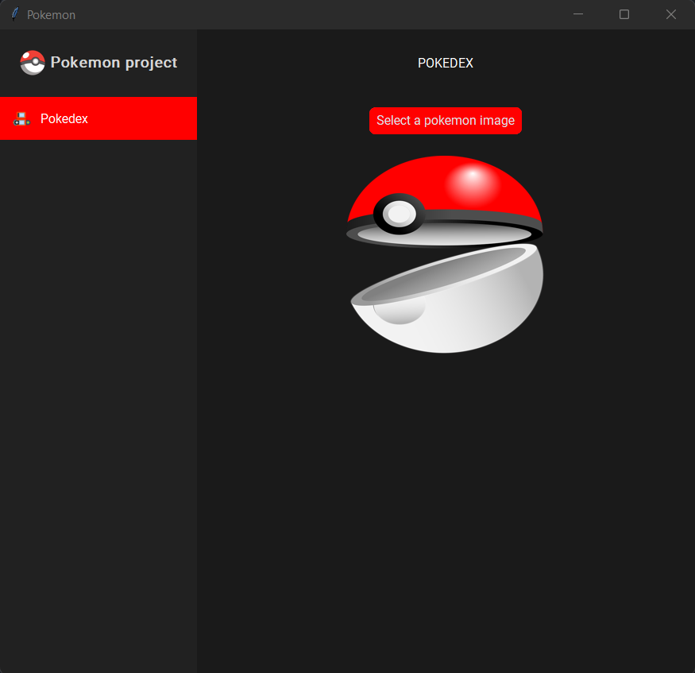
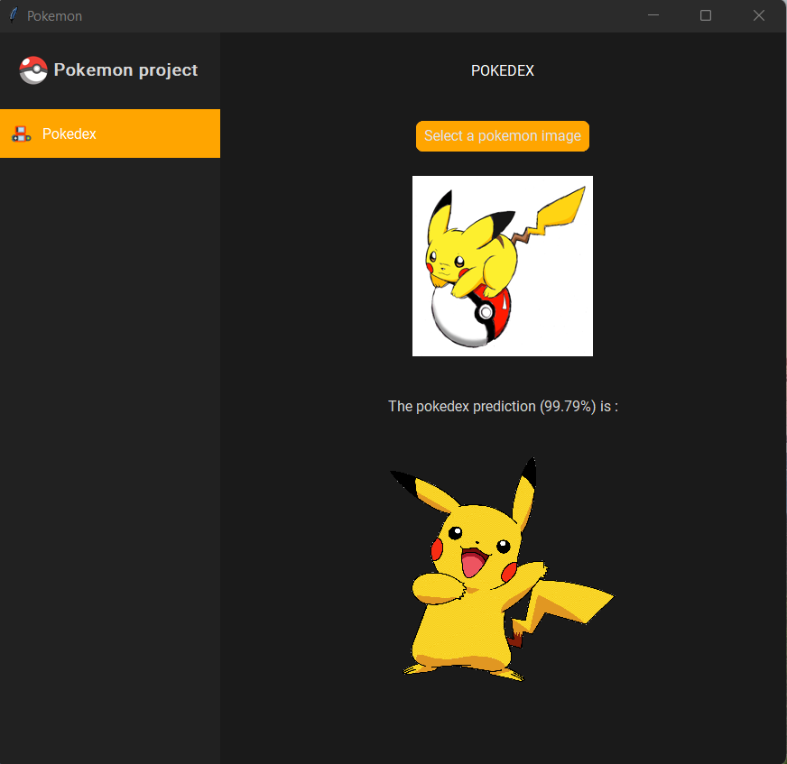
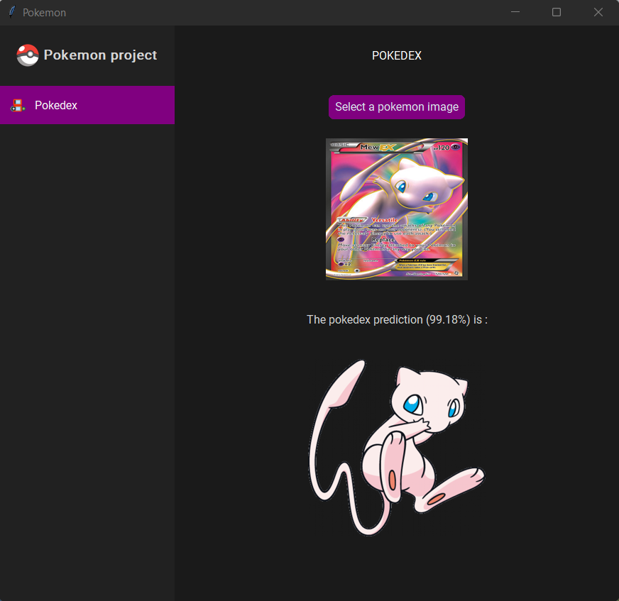
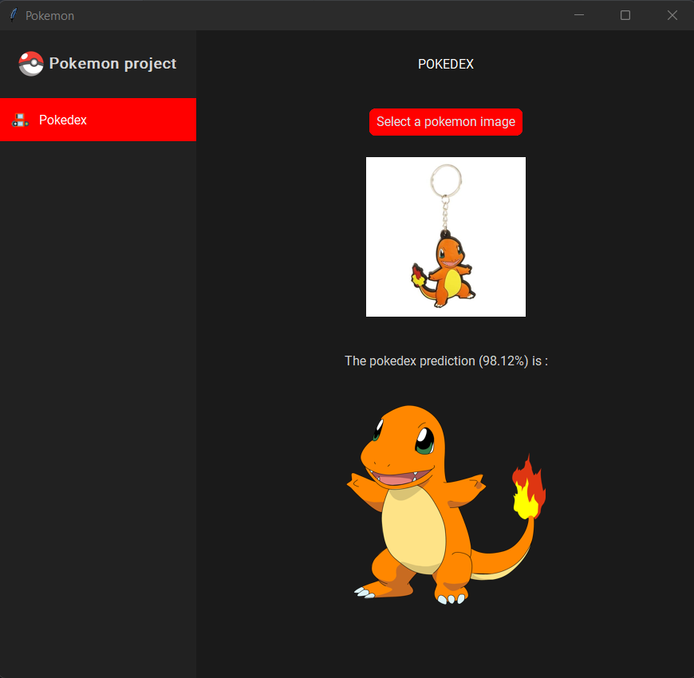
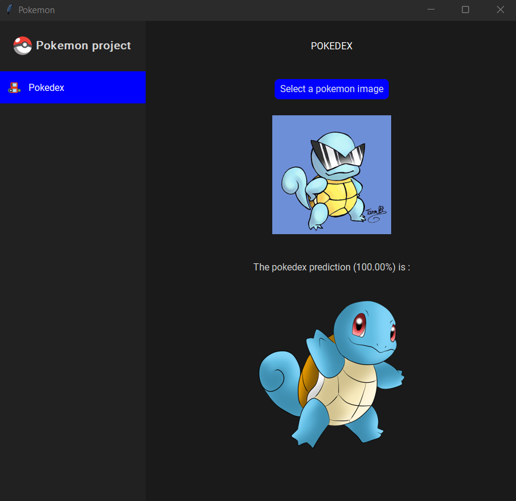
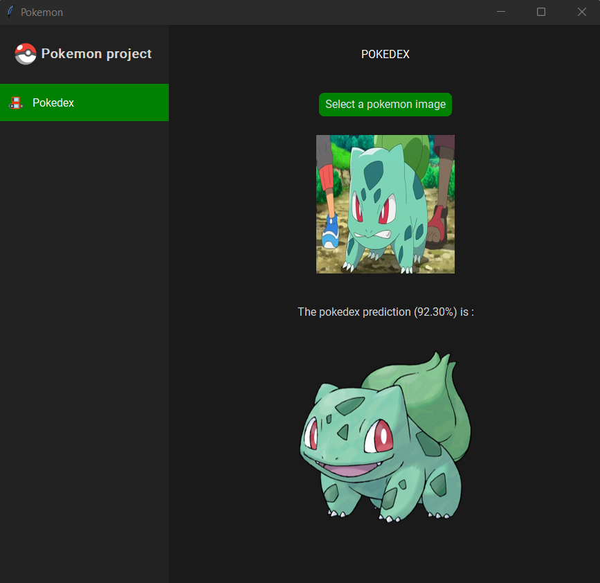

# Python Project on Pokemon data

The goal of this project is to use machine learning models to predict data about pokemon. The first part is an image classification with a CNN.

## Image classification

This image classification work for 5 pokemons : Bulbasaur, Charmander, Mew, Pikachu, Squirtle.
When you arrive on the pokedex window, you have to select an image.

  
   
  

  
   
  

